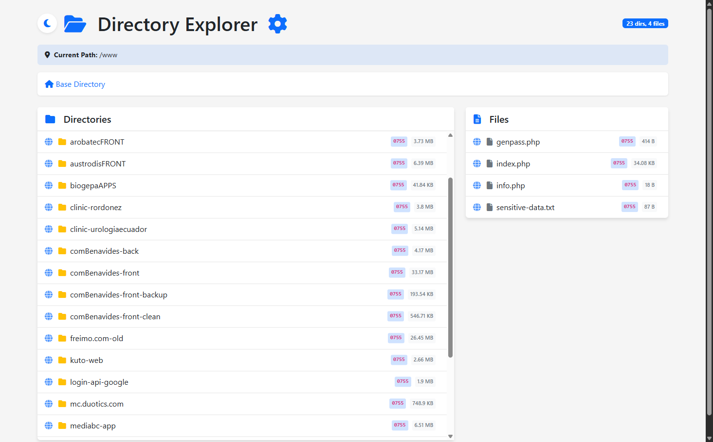
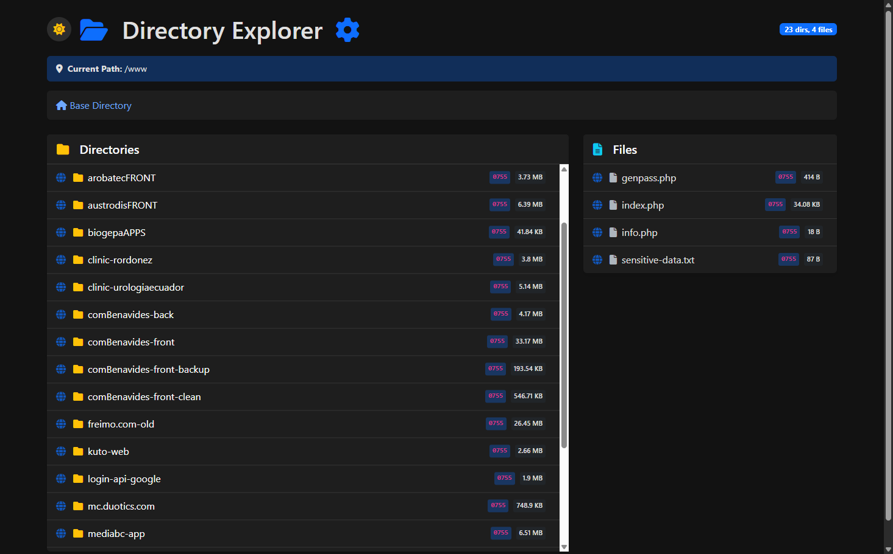
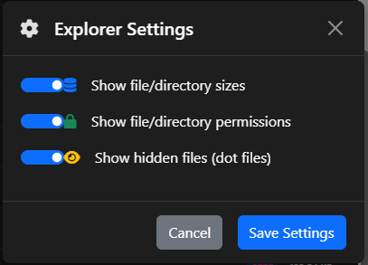

# PHPDirExplorer

A modern PHP-based directory explorer designed for web developers. Navigate your local development environment with ease, inspect files, check permissions, and access web resources directly.

## Screenshots

### Light Mode


### Dark Mode


### Settings Panel


## Features

- **Modern Interface**: Clean, responsive design using Bootstrap 5
- **Dark/Light Mode**: Toggle between themes with persistent preferences
- **File & Directory Management**: Easy navigation through your file system
- **Permissions Display**: View UNIX permissions in both symbolic and octal formats
- **Size Information**: See file and directory sizes with human-readable formatting
- **Hidden Files**: Option to show/hide dot files and directories
- **Web Access**: Direct links to web-accessible files and directories
- **Fully Configurable**: Settings modal to customize your experience
- **Tooltips**: Hover information showing full paths
- **Breadcrumb Navigation**: Always know your location in the file system

## Installation

### Quick Install (Recommended)

1. **Clone the repository** en la raíz de tu webserver como `.explorer`:
   ```bash
   cd /var/www/html  # o tu document root
   git clone https://github.com/duotics/PHPDirExplorer.git .explorer
   ```

2. **Configura el .htaccess** en el directorio padre (raíz del webserver):
   ```bash
   cp .explorer/.htaccess.example .htaccess
   ```
   
   > ⚠️ **Importante**: El `.htaccess` debe estar al **mismo nivel** que la carpeta `.explorer`, NO dentro de ella.

3. **Estructura final**:
   ```
   /var/www/html/
   ├── .htaccess          ← Copiado desde .htaccess.example
   ├── .explorer/         ← Repositorio clonado
   │   ├── index.php
   │   ├── config.php
   │   ├── functions.php
   │   └── ...
   ├── tu-proyecto-1/
   ├── tu-proyecto-2/
   └── ...
   ```

4. **Accede** a través de tu navegador: `http://localhost/`

### Requisitos de Apache

Asegúrate de que Apache tenga habilitado el módulo `mod_rewrite`:
```bash
sudo a2enmod rewrite
sudo systemctl restart apache2
```

Y que tu configuración de Apache permita `.htaccess` (en el VirtualHost o apache2.conf):
```apache
<Directory /var/www/html>
    AllowOverride All
</Directory>
```

### Instalación Manual (Alternativa)

Si no quieres usar `.htaccess`, puedes acceder directamente a:
```
http://localhost/.explorer/
```


## Usage

- **Navigate Directories**: Click on folders to enter them
- **Access Files**: Click on the globe icon to open web-accessible files in your browser
- **Change Theme**: Click the sun/moon icon to toggle between light and dark themes
- **Configure Settings**: Click the gear icon to access settings:
  - Show/hide file and directory sizes
  - Show/hide permissions
  - Show/hide hidden files (dot files)

## Security Considerations

This tool is intended for **local development environments only**. It provides direct access to your file system, so please do not use it in production environments or publicly accessible servers.

## Requirements

- PHP 7.4 or higher
- Web server (Apache, Nginx, etc.)
- Modern web browser with JavaScript enabled

## Browser Compatibility

- Chrome/Edge (latest versions)
- Firefox (latest version)
- Safari (latest version)

## Author

**Daniel Banegas** - [DUOTICS](https://duotics.com)

- Website: [duotics.com](https://duotics.com)
- GitHub: [@duotics](https://github.com/duotics)

## Credits

- [Bootstrap](https://getbootstrap.com/) - Frontend component library
- [Alpine.js](https://alpinejs.dev/) - Lightweight JavaScript framework
- [Font Awesome](https://fontawesome.com/) - Icon toolkit

## License

This project is licensed under the MIT License - see the LICENSE file for details.

## Contributing

Contributions are welcome! Please feel free to submit a Pull Request.

1. Fork the repository
2. Create your feature branch (`git checkout -b feature/AmazingFeature`)
3. Commit your changes (`git commit -m 'Add some AmazingFeature'`)
4. Push to the branch (`git push origin feature/AmazingFeature`)
5. Open a Pull Request

---

Made with ❤️ by [Daniel Banegas](https://duotics.com)
